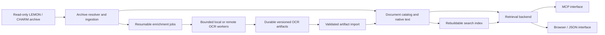

# Bounded Spark OCR pilot: aggregate results

Measured 2026-09-28–29 on NVIDIA DGX Spark. This report publishes aggregate measurements, methodology, limitations and a proposed architecture. It contains no source images, harvested OCR, manual excerpts, source-page identifiers, gold transcripts or review galleries. The original corpus and detailed outputs are retained privately and are not distributed with this repository. See [methodology and model identities](ocr-pilot-methodology.md) for the experiment's scope and reproduction limits.

## Decision

For the first bounded integration and coexistence trials, use PP-OCRv6 small as the provisional CPU candidate: one process × four ONNX threads, `MemoryMax=2G`, zero swap. The tested Spark configuration achieved **2.134 images/sec and 1.004 GiB cgroup peak**. On twenty manually reviewed pages it recovered 54/57 component-code anchors and 41/45 pin anchors. The larger-model follow-up supports keeping it as the CPU background candidate: medium improves rotated labels and server improves upright pins, but neither is uniformly better. Medium fits the same 2 GiB CPU cap, but small delivers about 4.5 times its throughput on the same worker. Production model selection still requires retrieval precision/recall and further orientation evaluation.

CPU alongside the existing GLM inference workload: go for a supervised coexistence acceptance run; no-go for weeks unattended yet. The proposed worker `MemFree` stop floor is 4 GiB and still requires validation under simultaneous GLM load. Fetch/decode/output buffers must remain within the same cap. Preflight found no running earlyoom process or active earlyoom service on either host. The idle-host pilot harness is not a production scheduler.

GPU/VLM OCR: use an idle window for now. V5 server is the strongest tested conventional model for upright pin anchors; docTR 2048 leads the rotated-callout category; v6 medium offers an intermediate accuracy tradeoff. These are task-specific results, not a single overall winner. No simultaneous GLM load was tested. CUDA/driver allocations are not fully reflected in the Docker cgroup; separate NVIDIA-process and host free-memory observations are necessary.

## Method and limitations

The fixed corpus contains 500 unique image-only-page images, 49.3 MiB, from three vehicles, all CHARM-source. Twenty pages were manually reviewed; this does not independently validate LEMON-source scans. Accuracy figures measure selected-anchor recall, not full-page accuracy, precision or archive-wide accuracy. Classical checks use annotated source regions for pins, callouts and selected locations. The shared model gallery uses unlocalized code/location checks for every model; interleaved reading order can change phrase scores. Whole-page VLM output cannot establish spatially correct pin readings.

All tested conventional models recovered the motivating page’s component and location anchors. No search index was changed, so its current MCP search behavior is unchanged.

The VLM screen used the same twenty pages plus eleven supplied crops and one blank control. Crops were selected after classical failures and before VLM inference, so this is a diagnostic challenge. Strict token matching and manually recognized visible values can differ. Model-specific prompts, preprocessing and parsing paths are part of the result; no prompt or decoding sweep was performed.

Two Sparks were checked idle before measurement. CPU runs used the worker except where the head is explicitly identified; GPU/VLM screens used the idle head. Setup used isolated venvs/containers. No MCP, search-index or deployment changes were made. These measurements do not establish performance on other CPU architectures, accelerators or shared workloads.

## CPU throughput and memory

PP-OCRv5 mobile detector + English mobile recognizer, RapidOCR 3.9.2 / ONNX Runtime 1.30.0, CPU-only. All twelve runs completed with no OCR errors, OOMs or memory-limit events. Detailed measurements remain in the local review artifacts.

| Processes × threads | MemoryMax | Images/sec | Cgroup peak GiB |
|---|---|---:|---:|
| 1 × 1 | unlimited | 0.930 | 0.951 |
| 1 × 1 | 2 GiB | 0.940 | 0.962 |
| 1 × 2 | 2 GiB | 1.405 | 0.972 |
| 1 × 2 | unlimited | 1.631 | 0.941 |
| 1 × 4 | unlimited | 2.499 | 0.980 |
| 1 × 4 | 2 GiB | 2.459 | 0.952 |
| 2 × 1 | 2 GiB | 1.768 | 1.581 |
| 2 × 1 | unlimited | 1.863 | 1.584 |
| 2 × 2 | unlimited | 3.060 | 1.631 |
| 2 × 2 | 2 GiB | 2.903 | 1.600 |
| 2 × 4 | 2 GiB | 4.253 | 1.641 |
| 2 × 4 | unlimited | 3.997 | 1.623 |

One pass per configuration, alternating cap order; no statistical confidence interval or CPU affinity. The capped/uncapped rate differences are run variation, not demonstrated cap overhead: all `memory.events` counters were zero. Peak includes charged file cache; shared cached libraries can be charged elsewhere. RSS, cgroup and GPU memory are overlapping measures and must not be added together.

PP-OCRv6 small, one process, same 500 images and preprocessing. All four cells completed without OCR errors or memory-limit events. A dropped SSH connection after the two-thread cells stopped the controller cleanly; only the remaining four-thread cells were resumed. Detailed measurements remain in the local review artifacts.

| Threads | MemoryMax | Images/sec | Cgroup peak GiB |
|---:|---|---:|---:|
| 2 | unlimited | 1.361 | 0.995 |
| 2 | 2 GiB | 1.406 | 0.986 |
| 4 | unlimited | 2.089 | 0.986 |
| 4 | 2 GiB | 2.134 | 1.004 |

PP-OCRv6 medium, one process × four threads, on the worker with the same 500 images and pinned CPU environment. Both runs completed with zero OCR errors, zero memory-limit events and matching benchmark/stop-helper peaks. All scored anchors match the medium CUDA run. The single pass per cap does not establish the cause of the throughput difference.

| MemoryMax | Images/sec | Cgroup peak GiB |
|---|---:|---:|
| unlimited | 0.501 | 1.762 |
| 2 GiB | 0.478 | 1.755 |

PP-OCRv5 server used one process × four threads on the idle **head**, in a venv installed from the same pinned CPU requirements. This avoids overlapping CPU measurements on one host, but the host difference and lack of CPU affinity remain comparison limits.

| MemoryMax | Outcome | Images/sec | Cgroup peak GiB |
|---|---|---:|---:|
| unlimited | 500/500, no OCR errors | 0.281 | 2.878 |
| 2 GiB | OOM kill before any image result | — | 2.000 |

The uncapped run completed in 1,780.8 seconds, within its thirty-minute deadline, with zero memory-limit events. The capped run failed after 8.1 seconds with 939 max-limit events, four OOM events and one OOM kill; benchmark and stop-helper snapshots independently retained the exact 2 GiB limit/peak and zero swap. Its summary reports interruption following the OOM; throughput is deliberately null. Server does not fit 2 GiB with this tested preprocessing and thread configuration. Every scored anchor in the successful CPU run matches its CUDA result.

## Classical OCR accuracy

| Classical OCR | Codes /57 | Pins /45 | Locations /13 | Rotated callouts /35 | Table anchors /26 |
|---|---:|---:|---:|---:|---:|
| PP-OCRv5 mobile | 52 | 33 | 12 | 3 | 25 |
| PP-OCRv6 small | 54 | 41 | 12 | 17 | 24 |
| PP-OCRv6 medium (Spark CPU and CUDA) | 54 | 40 | 13 | 22 | 25 |
| PP-OCRv5 server (Spark CPU and CUDA) | 55 | 44 | 12 | 5 | 23 |
| docTR 1024 GPU | 55 | 32 | 12 | 23 | 23 |
| docTR 2048 GPU | 55 | 35 | 13 | 28 | 25 |

The full 500-image docTR 2048 run achieved 2.155 images/sec with a 2.825 GiB cgroup peak, 1.781 GiB CUDA allocated / 2.111 GiB reserved peaks, and 2.322 GiB observed NVIDIA process memory. Host free memory dropped by 5.44 GiB. It improved rotated callout recall but did not improve throughput materially over the recommended CPU configuration. A separate earlier manual 90° rotation probe improved v5 mobile’s callouts from 3/35 to 16/35; this is outside the fixed benchmark pipeline. Orientation handling remains a candidate for a separate comparison.

The follow-up now includes full Spark CUDA measurements of v6 medium and v5 server, plus complete capped and uncapped v6-medium Spark CPU runs and the uncapped v5-server CPU run. Every scored v6-small and v6-medium anchor matches across CPU and CUDA; medium also matches its earlier Mac screen. V5 server improves upright pin recall but loses many rotated callouts; v6 medium gains five rotated callouts versus small while losing one pin. These larger models do not dominate small across the scored categories.

## Larger conventional GPU measurements

All three RapidOCR 3.9.2 / PyTorch CUDA float32 runs completed the same 500 images with no OCR errors or memory-limit events. The dedicated container and CUDA allocator each had a 12 GiB budget, zero swap and a twenty-minute deadline. Detection/recognition/orientation parameters were verified on CUDA. Startup, weight verification and warmup are included in throughput. These are finite batch jobs without SparkRun or global cache clearing.

| Model | Images/sec | Cgroup peak GiB | CUDA allocated / reserved GiB | NVIDIA peak GiB | Host free-memory drop GiB |
|---|---:|---:|---:|---:|---:|
| v6-small | 4.340 | 1.704 | 0.571 / 1.152 | 1.361 | 3.342 |
| v6-medium | 2.340 | 2.005 | 1.808 / 3.365 | 3.576 | 5.588 |
| v5-server | 3.101 | 2.042 | 4.789 / 9.469 | 9.680 | 11.952 |

Medium is the largest tier in the [PP-OCRv6 model documentation](https://github.com/PaddlePaddle/PaddleOCR/blob/main/docs/version3.x/algorithm/PP-OCRv6/PP-OCRv6.en.md); the pilot pins conversion artifacts from the [RapidOCR registry](https://github.com/RapidAI/RapidOCR/blob/main/python/rapidocr/default_models.yaml). The measured detector + recognizer parameter counts are about 7.8M for v6 small, 34.9M for v6 medium and 59.9M for v5 server, plus the same orientation classifier. All use the CPU pipeline’s detector limit, recognition batch size and confidence threshold; converted ONNX and PyTorch implementations remain different runtime paths. Larger parameter counts do not imply higher throughput or uniformly better recall. These GPU runs used the idle head and do not validate coexistence with GLM.

The separate diagnostic crops scored 11/29 for small, 21/29 for medium and 17/29 for server, with empty output on every blank control. All three still missed the three supplied rotated-number crops. Whole-page pins and isolated crops are distinct tasks: cropping can remove helpful context and trigger different resizing. Crop selection was diagnostic, not random.

## Local VLM comparison

| Model / tested path | Codes /57 | Locations /13 | Strict crops /29 | Token-limited /32 | Blank control |
|---|---:|---:|---:|---:|---|
| Paddle-native | 38 | 12 | 17 | 3 | Empty |
| GLM-OCR | 55 | 12 | 23 | 0 | Empty fence |
| OvisOCR2 | 35 | 12 | 28 | 0 | Invented 1 |
| TeleOCR | 31 | 11 | 26 | 5 | Invented math |
| Granite-Docling | 13 | 10 | 1 | 0 | Invented prose |
| MinerU-Pro | 21 | 12 | 28 | 0 | [Non-Text] |
| Qwen27-NVFP4 | 53 | 13 | 26 | 3 | Invented sequence |

| Model | Startup sec | Screen sec | Cgroup peak GiB | NVIDIA peak GiB | Host free-memory drop GiB |
|---|---:|---:|---:|---:|---:|
| Paddle-native | 16.6 | 90.3 | 2.361 | 2.340 | 4.356 |
| GLM-OCR | 100.5 | 81.9 | 7.171 | 4.716 | 9.111 |
| OvisOCR2 | 117.1 | 115.7 | 8.198 | 3.366 | 6.373 |
| TeleOCR | 17.7 | 353.6 | 3.507 | 4.123 | 8.516 |
| Granite-Docling | 6.4 | 35.6 | 2.154 | 1.371 | 4.005 |
| MinerU-Pro | 20.5 | 55.3 | 3.039 | 3.291 | 7.511 |
| Qwen27-NVFP4 | 264.3 | 1299.0 | 14.171 | 22.067 | 30.110 |

All seven screens completed 32 requests with zero cgroup OOM/limit events and verified cleanup. Completion includes the token-limited responses counted above. Screen times exclude server startup and are not 500-image throughput measurements. Memory columns overlap and must not be added; host free-memory drops also include cache changes.

Native Paddle recovered all 29 supplied visible crop values by manual inspection, but row concatenation and Unicode forms reduced its strict score to 17. It repeated on three whole pages. GLM-OCR achieved the highest VLM page-code recall but fabricated numeric diagram labels. OvisOCR2 and MinerU recovered 28/29 crop targets; their full-page paths omitted substantial drawing text. TeleOCR repeated on four pages and the blank control. Granite-Docling frequently classified labels as pictures and invented prose on the blank control.

Qwen NVFP4 recovered all location anchors and 53/57 page codes, but repeated on two pages and invented a number sequence on the blank. The separate BF16 run completed only five pages before a request timeout; its observed NVIDIA peak was 53.32 GiB versus 8.54 GiB in the cgroup. Different checkpoint sources and incomplete BF16 coverage prevent a controlled quantization-accuracy comparison.

SparkRun 0.3.9 launched the isolated vLLM servers. Its default preparation cleared the idle head's global page cache, so these recipes must not be reused unchanged beside GLM. A Paddle vLLM path repeated/truncated 27/32 requests and was excluded from model comparison in favor of native Transformers. Tele used its native text prompt; MinerU used two-step page parsing; Granite emitted DocTags converted with docling-core. These are not controlled comparisons of weights alone.

Docling's conventional OCR/layout pipeline was not benchmarked. Granite-Docling is a separate VLM; its poor diagram-label result does not establish the behavior of conventional Docling with a selectable OCR engine.

## Integrated archive and retrieval architecture (proposed; not implemented)

[Architecture investigation #6](https://github.com/kelchm/lemon-manuals-mcp/issues/6) tracks the evolving proposal, open decisions and first implementation scope. The following section records the initial direction informed by this experiment.

The pilot establishes extraction quality and resource costs. It does not yet make OCR searchable or available through the MCP. Current [indexing and search](../../src/manual.ts) flatten native Markdown into `body_text`, strip image references from that text and index titles, breadcrumbs and body text in FTS5. Image-only pages receive a placeholder snippet. Current [page retrieval](../../src/page.ts) converts source HTML to Markdown; neither path reads the pilot artifacts.

The MCP is our prototype, so its existing process boundary, SQLite schema and tool response shapes are not requirements for the next design. The recommendation is an integrated archive/retrieval backend with MCP as an interface, background ingestion and enrichment, and a shared document model. Adding OCR fields to today's lazy HTTP-fetching cache would demonstrate value, but would leave the duplicate resolution logic and request-time indexing architecture in place.

### Source ingestion and deployment portability

The design should be specific about LEMON/CHARM semantics and portable across infrastructure. A useful baseline is one machine running the retrieval service, an ingestion command and a CPU worker with local persistent directories. The first source adapter takes user-supplied LEMON/CHARM index files and an HTTP endpoint compatible with the archive's HTML and URL conventions; it is not a general website scraper. Public synthetic fixtures should exercise that compatibility contract. Reading MTBL directly is an optional optimization. Public installation must not require access to a private repository or prebuilt private container.

A direct reader must preserve the source resolver's behavior: LEMON traverses URI and link tables; CHARM resolves a path to an offset key and then to HTML. Dumping MTBL values alone does not reconstruct the document graph. Define a source-adapter contract that enumerates placements and resolves page content, images and cross-references into the shared model. Both HTTP and a future direct reader should satisfy the same source-resolution tests. This makes the archive boundary explicit without tying the retrieval API to HTML scraping or a particular Rust/TypeScript process split.

| Responsibility | Baseline implementation to prove | Optional deployment extension |
|---|---|---|
| Source access | Configured archive HTTP endpoint | Local/mounted MTBL reader |
| Catalog and search | Service-owned SQLite/FTS5 on local persistent storage | Partitioning or another database when measured scale requires it |
| Durable artifacts | Private filesystem directory with manifests and checksums | Object storage, such as an S3-compatible bucket |
| OCR execution | Separate pinned Python CPU worker, using a versioned input manifest and output artifacts | Remote CPU/GPU workers and additional model adapters |
| Job execution | One bounded local worker; resume from validated completion state | External scheduling and remote-worker coordination when needed |
| Model serving | OCR engine inside the Python worker process | Configured inference endpoint or optional SparkRun deployment recipe |
| Client access | MCP over a shared retrieval core | JSON API and browser using the same semantics |

Paths, endpoints, credentials, model selection, concurrency, threads, memory/read budgets and deadlines belong in configuration. Linux cgroup guards are a runner capability; equivalent limits on another platform must be implemented and verified before claiming the same guarantees. A remote worker should use a documented, versioned job/result contract with authenticated transport, not SSH into the service or share its database file. Keep local service endpoints loopback-bound by default; external access requires deliberate configuration. Model/runtime availability is platform-specific and must be checked rather than silently falling back to hosted inference.

The baseline should not require Kubernetes, a NAS, Longhorn, S3, Redis, SparkRun, a GPU or a particular secret manager. Those can be deployment profiles. Implement only the initial adapters and contracts needed for a working installation; additional infrastructure support should follow actual demand. This portability is a proposed design requirement, not a capability delivered by this experiment.

### One document model, separate serving and batch execution

These are logical responsibilities. For the first slice, evolve this repository into a modular Bun/TypeScript retrieval core, a thin MCP interface and explicit ingest/OCR/import/index commands. Run the measured Python OCR pipeline in a separate local process. Publish checksummed results durably before recording completion; validate successful artifacts on resume and distinguish failed/incomplete work from successful empty OCR. Remote protocols, leases and expired-lease recovery are deferred until remote execution is needed. A future remote worker must not open the serving SQLite database across the network. SQLite/FTS5 is the initial projection store; full-corpus size, ingest cost and concurrency still require measurement.

The catalog should distinguish **source revision and vehicle/manual placement**, **document content**, **image assets**, and **enrichment results**. Stable opaque placement IDs should include source namespace, corpus, explicit manual scope and opaque placement path, so they survive projection rebuilds without merging distinct placements. Source-content revisions must account for fetched page/image content; an index-file hash plus adapter version cannot detect every content change. Preserve ordered page-image associations, native text, page hierarchy, cross-reference targets, source applicability and all duplicate placements. Reusing identical content must not merge distinct vehicle applicability. Resolve stubs with both the referring page and target provenance available.

Use SHA-256 of original image bytes for image identity, and pair it with an extraction-pipeline fingerprint for OCR identity. The fingerprint includes checkpoint hashes, preprocessing/thresholds, language/dictionary, orientation and engine version. The existing `manual_documents.content_hash` hashes page text plus image paths, not image bytes; it is insufficient for deduplicating OCR work. OCR changes must not change source-document identity.

Retain recognized text, boxes transformed back to original-image coordinates, image dimensions, engine scores, model provenance and distinct success/empty/failed/unprocessed states. Scores are not calibrated correctness probabilities. Preserve immutable model outputs and explicitly select the serving version; do not concatenate every model's conflicting transcript. The shared representation can later hold layout/table extraction or VLM annotations as separate evidence types, with their own validation. The pilot does not justify treating generated diagram descriptions as established wiring relationships, and the conventional Docling pipeline was not benchmarked.

Canonical extraction results must survive index rebuilds. The current MCP search database is a rebuildable cache, and schema upgrades currently drop its manual tables. A deployment may reasonably exclude such a cache from backups. Keep canonical output in private, backed-up artifact storage with manifests/checksums, and preserve or reconstruct catalog mappings from source revisions and import manifests. Search projections can then be discarded without repeating weeks of OCR. Expose artifact placement as configuration and document the complete recovery bundle: OCR outputs, source/native-content manifests and placement mappings, selected pipeline configuration, and access to the exact source-image bytes. An OCR-output directory alone is not a proven recovery strategy. Build new catalog/search generations outside request handling and define a coherent connection handover; do not replace an open WAL database by simply renaming a file over it. SQLite documents the risks of [renaming a database while it is in use](https://www.sqlite.org/howtocorrupt.html#unlinking_or_renaming_a_database_file_while_in_use).

### How callers use the results

Begin with an explicitly selected manual and page-level hits containing separately labeled native/OCR evidence, image references and boxes when available. Match component/pin identifiers exactly and exercise longer lookalike identifiers in tests. Cross-manual drivetrain grouping is deferred because the current grouping heuristics do not establish equivalent applicability. Native text, literal OCR and generated annotations remain distinguishable. Vehicle/applicability filtering belongs in retrieval, before results reach the caller. Ranking and query semantics can change from today's prefix-AND implementation if retrieval tests support the change; neither embeddings nor a vector database are prerequisites for this pilot's demonstrated gap.

A page response should return bounded native content, ordered image references and cached OCR blocks, with pagination or explicit truncation and coverage state. A result envelope can include stable IDs, source revision, index/enrichment coverage and pending/error status even when there are zero matches. Original-image or region retrieval then lets the caller inspect the exact evidence behind a snippet. Tool names and schemas can be redesigned around this workflow; preserving today's `search_manual` array or `get_page` Markdown-only contract is optional. The browser should be able to use the same retrieval semantics instead of maintaining a second search implementation.

For the motivating private example, the flow is **location-text query → correct vehicle/page → OCR excerpt → original image for verification**. Today that text is invisible to the index. In the proposed design, an agent finds the page without downloading and visually reading every candidate diagram first, and can fetch the evidence when precise pins or spatial relationships matter. OCR makes text findable; it does not establish a circuit's connectivity or validate a repair instruction.

Keep inference outside interactive requests. An unprocessed image should return useful native content and explicit coverage, and may be queued for background enrichment without holding the request open. Start with the measured CPU candidate; GPU reprocessing for difficult images is a separate policy to validate. The pilot's weak or missing OCR can motivate review, but there is no validated automatic model-routing threshold yet.

### The next practical proof

[Implementation issue #7](https://github.com/kelchm/lemon-manuals-mcp/issues/7) tracks this bounded slice and its acceptance criteria.

Build a bounded vertical slice of the integrated design that runs on one machine without the original lab infrastructure. Use synthetic fixtures for public installation and retrieval checks, then validate privately with the already-produced 500-image outputs and an isolated catalog/index. First prove synthetic ingest → CPU OCR → index → MCP search → page/original-image evidence. Then resolve the three sampled manuals from the archive, privately import one selected OCR version and validate the real retrieval path. Add a small LEMON-source control set because every pilot image came from CHARM. Compare source resolution with the existing reader, including encoded paths, cross-references, duplicate placements, applicability and ordered multi-image pages.

Acceptance includes the motivating location query, the reviewed component/pin queries, wrong-manual exclusions, native-text retrieval, query-relevant snippets, explicit incomplete coverage, response budgets, repeat imports and a projection rebuild without new inference. Measure retrieval precision as well as recall and compare cold/warm latency with today's path. Serving and health checks must remain responsive during ingestion; the existing [cold-indexing issue #3](https://github.com/kelchm/lemon-manuals-mcp/issues/3) provides a concrete regression case. Synthetic fixtures can be committed; manual-derived fixtures stay private.

This slice should establish the shared model and archive boundary before a corpus-wide rollout. Prioritize referenced images in selected manuals, starting with image-only pages, then measure the benefit of embedded-image coverage. Production job scheduling, backups, end-to-end fetch/import cost and GLM coexistence acceptance remain separate unfinished work. Nothing in this architectural proposal changes the pilot's no-go for weeks of unattended coexistence today.

### Documentation ownership

Keep measured results and this proposed direction in this repository. Maintain the eventual schema/API contract, portable installation guide and durable architecture decisions alongside the implementation. Clearly distinguish supported deployments from measured hardware and optional examples. Site-specific scheduling, credentials, storage and recovery procedures belong with each deployment's configuration. Track bounded implementation work in issues; link this report instead of duplicating its findings. Manual-derived artifacts remain outside the public repository.

## Scale, verification and final state

At the recommended measured rate, one million images take about 5.42 days, excluding remote fetches, persistence, index import and GLM contention. This is an arithmetic extrapolation. A pre-pilot census of 95 already-indexed manuals found 29,882 image-only pages among 366,753 pages (about 8%), deduplicated to 13,588 documents under the MCP’s text/path hash. That is not a verified count of byte-unique images or an archive-wide coverage estimate. Enumerating image references and hashing bytes is necessary to establish the actual OCR backlog. The indexed image-only-page proportion cannot be multiplied directly by the archive’s image count.

Eleven local harness tests passed; all 500 corpus hashes and 32 gallery images were verified. Both Sparks were idle after final cleanup, with no pilot processes, services, timers, containers or listeners. Temporary transfer/review services were stopped. No MCP implementation, merge or deployment was part of the experiment.

The current publication is documentation only. The host-specific experiment harness and private fixtures are not included, so this is not a turnkey reproduction package. A reusable runner with configurable inputs and synthetic fixtures is separate work. The [methodology](ocr-pilot-methodology.md) explains how to run an analogous evaluation on independently supplied data and which comparisons would require the original private corpus.
